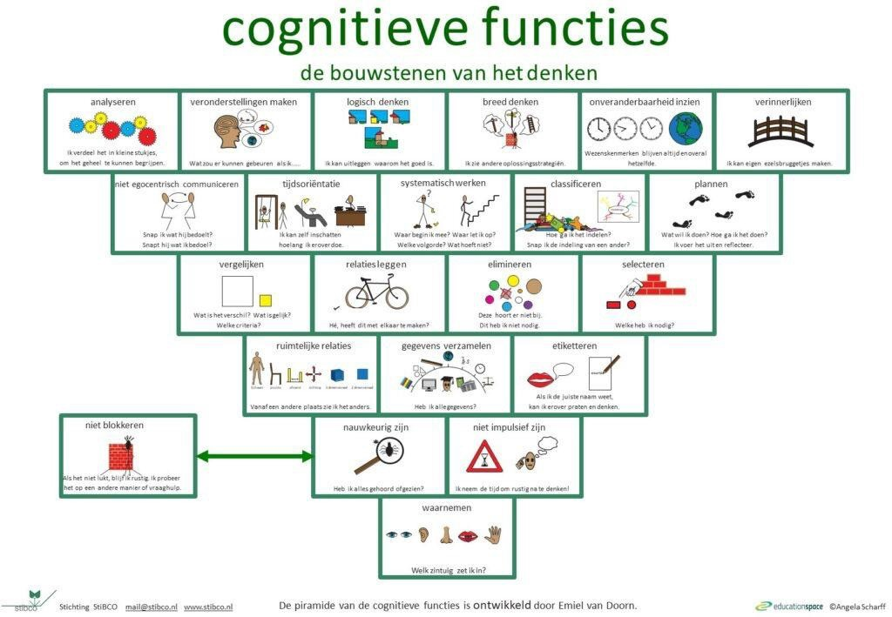
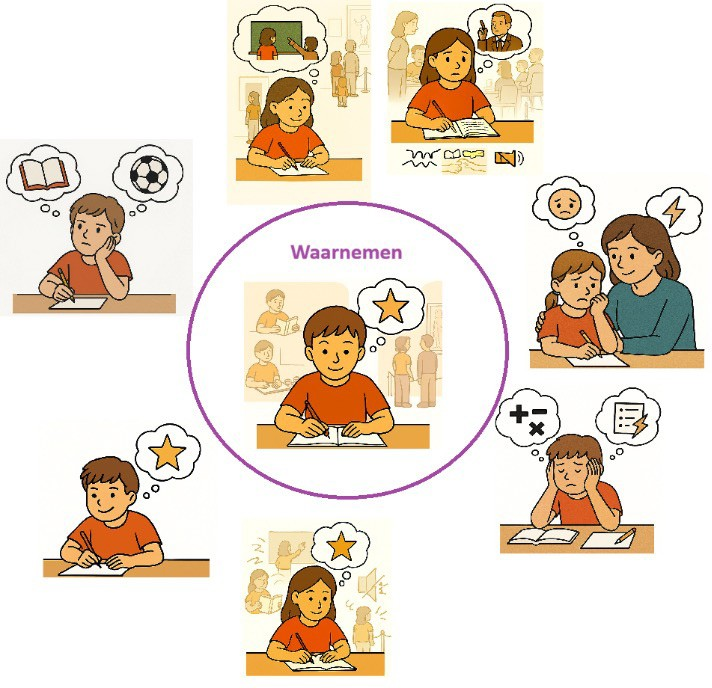
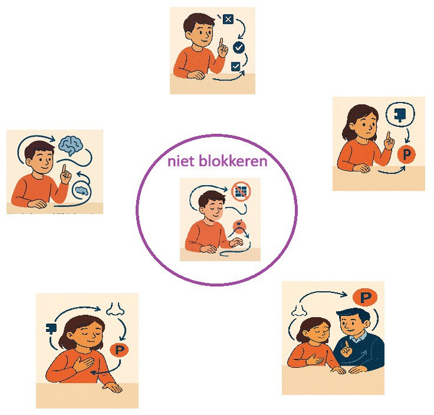
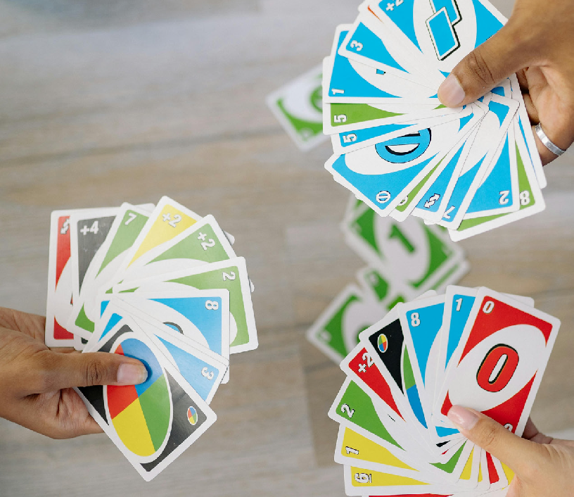

{width="6.200694444444444in"
height="2.129861111111111in"}

##### Spelend beter leren

> Executieve functie:

# Taakinitiatie

##### Kinderen van 7 - 9 jaar

> Voor groepen:

2

### Overzicht

#### Algemeen

Lesbrief 4

[Let op 6](#_TOC_250003)

[Waarnemen 7](#waarnemen)

[Niet-blokkeren 8](#niet-blokkeren)

Cognitieve functies voor Taakinitiatie

[Nauwkeurig zijn
9](#afbeelding-met-persoon-papierprodcut-kaartspel-kunstpapier-door-ai-gegenereerde-inhoud-is-mogelijk-onjuist.nauwkeurig-zijn)

Niet impulsief zijn 10

Ruimtelijke relaties 11

Gegevens verzamelen 12

Vergelijken 13

Relaties leggen 14

Elimineren 15

Selecteren 16

**\
**

> Binnen de CoFun vormt deze lesbrief de start van de praktische
> uitwerkingen die leerkrachten houvast biedt bij het begeleiden van
> kinderen in hun ontwikkeling. Een belangrijk uitgangspunt binnen deze
> benadering is dat elk kind een individu is, met een eigen tempo, eigen
> behoeften en een unieke ontwikkelingslijn. Daarom staat observeren
> centraal: niet toetsen, maar kijken, luisteren en betekenis geven aan
> wat een kind laat zien in zijn handelen. Dit sluit aan bij de visie
> dat ontwikkeling het best zichtbaar wordt in natuurlijke situaties,
> waarin kinderen spontaan laten zien welke cognitieve en executieve
> functies zij al beheersen (Dawson & Guare, 2019; SLO, 2019).
>
> We volgen de omgekeerde piramide die is ontwikkeld door van Doorn
> (2017), deze biedt een helder kader om de cognitieve ontwikkeling te
> begrijpen. De piramide is omgekeerd opgebouwd: de lagen bevatten de
> fundamentele cognitieve functies (bouwstenen), waarop hogere
> denkprocessen, zoals metacognitie en executieve functies voortbouwen.
> Kinderen in het primair onderwijs werken vooral binnen deze onderste
> vier lagen. Elke laag vertegenwoordigt een afzonderlijke cognitieve
> bouwsteen, samen vormen zij het fundament waarop complexere
> vaardigheden kunnen ontstaan (Van Doorn, 2022).

{width="5.431270778652668in"
height="3.7665616797900263in"}

> Tijdens de basisschoolperiode ontwikkelen kinderen geleidelijk hun
> metacognitieve vermogens: het vermogen om na te denken over het eigen
> denken. Dit proces verloopt van concreet naar abstract, en van
> onderste bouwstenen naar hogere lagen. Deze opbouw sluit nauw aan bij
> wat bekend is uit de ontwikkelingspsychologie: kinderen leren van
> beneden naar boven, terwijl volwassenen vaak redeneren van boven naar
> beneden (Diamond, 2007). Voor kinderen betekent dit dat zij eerst
> basisfuncties moeten beheersen, voordat zij in staat zijn om hogere
> executieve functies zoals plannen, flexibiliteit of doelgericht gedrag
> effectief in te zetten.
>
> Wanneer er signalen zijn dat een kind moeite heeft met een bepaalde
> executieve functie, is het volgens de omgekeerde piramide niet zinvol
> om direct op die functie zelf te in te zetten. Executieve functies
> zijn namelijk geen geïsoleerde vaardigheden, ze bouwen voort op
> onderliggende cognitieve processen (Dawson & Guare, 2009; SLO, 2019).
> Door te werken aan deze fundamenten, bijvoorbeeld door spel, gerichte
> activiteiten of mediërend leren (bron StibCo) ontstaat ruimte voor
> groei in de executieve functies die daarboven liggen. Wordt er ondanks
> gerichte ondersteuning geen vooruitgang zichtbaar, dan kan dit erop
> wijzen dat de veronderstelde executieve functie niet het probleem
> vormt.
>
> Het essentiële onderdeel van dit proces is dat zowel de leerkracht als
> het kind zelf stappen in het handelen leert benoemen. Door taal te
> geven aan denkstappen, strategieën en keuzes, wordt het metacognitieve
> bewustzijn versterkt. Dit sluit aan bij inzichten uit onderzoek naar
> zelfregulatie en metacognitie, waarin het expliciteren van
> denkprocessen wordt gezien als een krachtige manier om leren te
> verdiepen (Sol & Stokking, 2023).
>
> Zo vormt de omgekeerde piramide niet alleen een hulpmiddel, het is een
> kompas dat kinderen inzicht geeft in hun denken. Het helpt
> leerkrachten om kinderen bouwsteen voor bouwsteen te begeleiden in hun
> ontwikkeling, met oog voor hun unieke behoeften en mogelijkheden. Door
> te investeren in het fundament van cognitieve functies, bouwen we aan
> sterke executieve functies en daarmee aan kinderen die steeds beter in
> staat zijn hun eigen leren te sturen.

## Let op!

###### Dit is belangrijk als je met CoFun werkt.

> Ervaar eerst zelf. Wij geloven dat deze spellen goed aansluiten bij de
> ontwikkeling van kinderen, maar dat betekent niet automatisch dat dit
> voor jou zo voelt. Neem niets blind over. Speel, ervaar, voel. Pas dan
> weet je wat het kind straks gaat ervaren.
>
> Sta model. Jij bent het model. Bij het voorbeeld zijn hoort óók winnen
> en verliezen. Laat kinderen zien hoe je dat doet, hoe jij omgaat met
> spanning, plezier, teleurstelling en succes. Maar ook welke stappen
> neem je en wat ondervind je. Bijvoorbeeld benoem als je zelf vast
> loopt en hoe je het oplost.
>
> We observeren, we toetsen niet. We kijken bij het kind naar handelen,
> keuzes en gedrag in het moment. Niet naar cijfers, niet naar
> formulieren, niet naar controle. Ontwikkeling zie je in doen.
>
> Reflecteren. Zonder reflectie blijft een spel slechts een spel. Door
> samen terug te kijken op wat een kind of jijzelf deed, dacht en
> voelde, ontstaat inzicht in de gebruikte cognitieve en executieve
> functies.
>
> Signaleer overal. Kinderen laten hun ontwikkeling niet alleen in de
> klas zien. Ga eens kijken bij gym, op het plein, in de gang, tijdens
> een oefenmoment of in een vrije situatie. Dáár zie je vaak het meest.
>
> Speel in verschillende contexten. Een spel moet het kind minstens drie
> keer, in drie verschillende situaties, hebben gespeeld én geobserveerd
> worden voordat je een conclusie trekt over de ontwikkeling van een
> executieve functie. Kinderen laten niet altijd hetzelfde gedrag zien
> en dat is precies waarom herhalen zo belangrijk is.
>
> Loop je vast? Onderzoek een andere executieve functie. Soms werkt een
> spel niet zoals je dacht. Soms zie je geen verandering. Dat is oké.
> Dan is het tijd om een andere executieve functie te proberen.
> Ontwikkeling is geen rechte lijn; het is zoeken, proberen, bijstellen
> en opnieuw beginnen.
>
> En tot slot. Heb vertrouwen in jezelf. Niemand hoeft dit in één keer
> perfect te kunnen. Fouten maken mag. Sterker nog: het hoort erbij. Het
> is een teken dat je leert, dat je probeert, dat je in beweging bent.
> Gun jezelf dezelfde ruimte die je de kinderen geeft. Hoe vaker je met
> Cofun werkt, hoe beter je wordt in kijken, voelen, begeleiden en
> interpreteren. Je groeit mee met de kinderen en dat is precies de
> bedoeling.

## Waarnemen

> Waarnemen is de eerste stap in elk denkproces. Het betekent dat een
> kind zijn aandacht bewust richt op de informatie die relevant is voor
> de taak. Omdat onze hersenen maar een beperkte hoeveelheid prikkels
> tegelijk kunnen verwerken, bepaalt deze selectie welke informatie het
> kind daadwerkelijk meeneemt in zijn denken. Waarnemen is dus geen puur
> zintuiglijke handeling, maar een cognitieve keuze: waar let ik op, en
> waarom? Kinderen die hun aandacht niet goed kunnen richten, missen
> cruciale informatie en lopen daardoor vast in opdrachten, sociale
> situaties of instructies.

{width="3.1883311461067367in"
height="3.0816666666666666in"}

## Niet-blokkeren

> Niet-blokkeren zorgt ervoor dat het denkproces kan doorgaan nadat
> informatie is waargenomen. Een kind kan cognitief blokkeren door vast
> te houden aan een strategie die niet werkt, of door te blijven hangen
> op een detail dat niet relevant is. Daarnaast kan een kind emotioneel
> blokkeren wanneer gevoelens zoals angst, spanning of onzekerheid het
> denken stilzetten. In beide gevallen stopt het denkproces, ook als het
> kind de informatie wél heeft waargenomen.
>
> {width="3.1423359580052495in"
> height="3.006666666666667in"}
>
> Samen vormen waarnemen en niet-blokkeren de basis van alle verdere
> cognitieve en executieve functies. Zonder gerichte aandacht en zonder
> mentale ruimte om door te denken, kan een kind geen gebruik maken van
> hogere functies zoals vergelijken, plannen, en uiteindelijk uit te
> komen op metacognitie. Deze twee bouwstenen bepalen dus of een kind
> überhaupt toegang heeft tot de rest van de piramide.

## {width="4.251968503937008in" height="3.673228346456693in"}{width="0.2298611111111111in" height="0.21597222222222223in"}Nauwkeurig zijn

> Voorbeeld:
>
> Heb ik alles gezien of gehoord?

## {width="4.251968503937008in" height="3.673228346456693in"}{width="0.2298611111111111in" height="0.21597222222222223in"}Niet impulsief zijn

> Voorbeeld:
>
> Ik neem de tijd om rustig na te denken!

## {width="4.251968503937008in" height="3.673228346456693in"}{width="0.2298611111111111in" height="0.21597222222222223in"}Ruimtelijke relaties

> Voorbeeld:
>
> Vanaf een andere plaats zie ik het anders.

## {width="4.251968503937008in" height="3.673228346456693in"}{width="0.2298611111111111in" height="0.21597222222222223in"}Gegevens verzamelen

> Voorbeeld:
>
> Heb ik alle gegevens?

## {width="4.251968503937008in" height="3.673228346456693in"}{width="0.2298611111111111in" height="0.21597222222222223in"}Vergelijken

> Voorbeeld:
>
> Wat is het verschil? Wat is gelijk? Welke criteria?

## {width="4.251968503937008in" height="3.673228346456693in"}{width="0.2298611111111111in" height="0.21597222222222223in"}Relaties leggen

> Voorbeeld:
>
> Hé, heeft dit met elkaar te maken?

## {width="4.251968503937008in" height="3.673228346456693in"}{width="0.2298611111111111in" height="0.21597222222222223in"}Elimineren

> Voorbeeld:
>
> Dit hoort er niet bij. Dit heb ik niet nodig.

## {width="4.251968503937008in" height="3.673228346456693in"}{width="0.2298611111111111in" height="0.21597222222222223in"}Selecteren

> Voorbeeld:
>
> Welke heb ik nodig?
